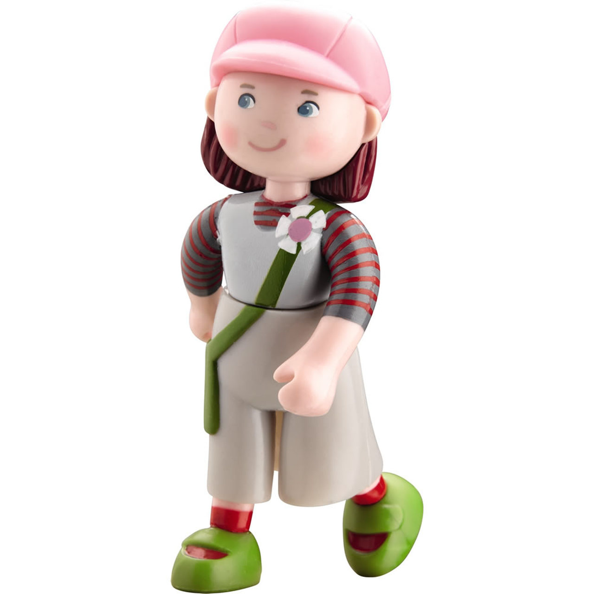
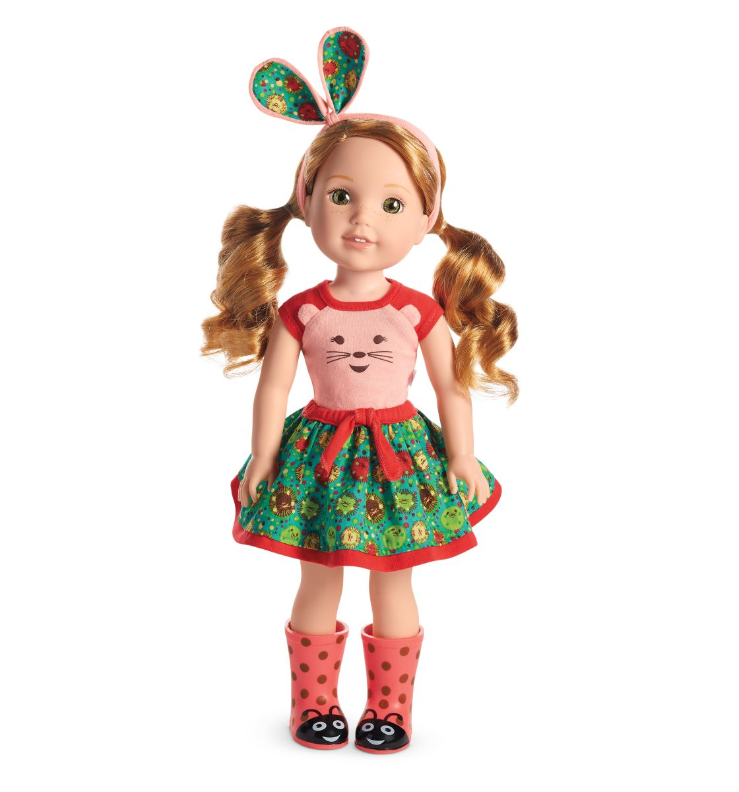
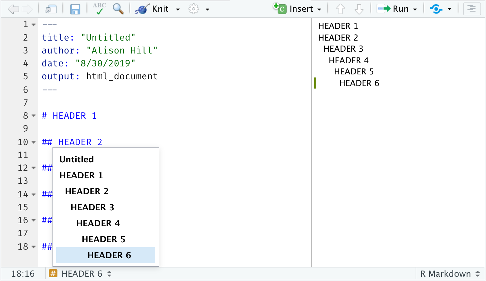
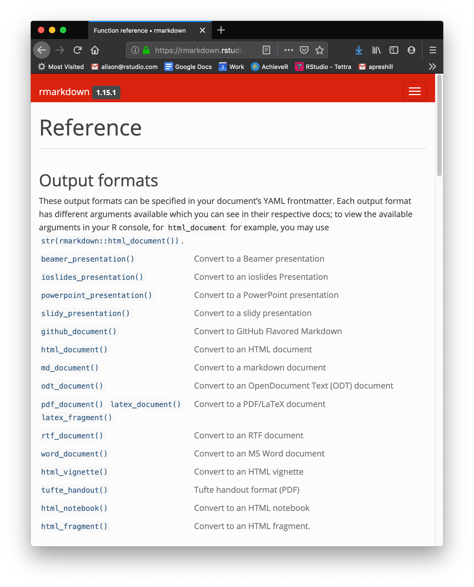
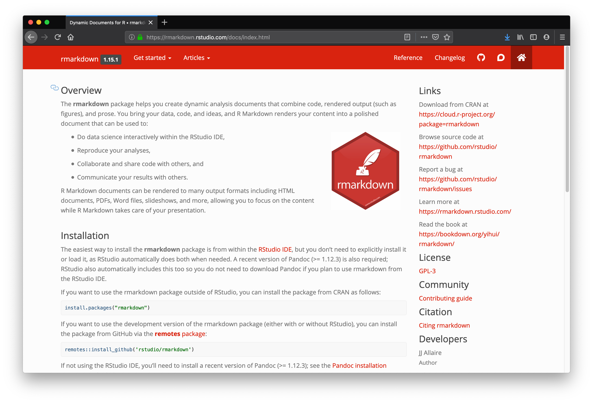

```{r setup, include=FALSE}
options(htmltools.dir.version = FALSE)
episode_counter <- 0
knitr::opts_chunk$set(
  collapse = TRUE,   
  comment = "#>"
)
```

```{r packages, include=FALSE}
library(countdown)
library(ymlthis)
library(tidyverse)
library(arsenal)
library(janitor)
library(scico)
library(cowplot)
ggplot2::theme_set(ggplot2::theme_minimal())
```

```{r load-data, include=FALSE}
mockdata <- read_csv(here::here("mockpaper/data/mockboston.csv")) 
```


class: title-slide, center, middle


# `r rmarkdown::metadata$title`

## `r rmarkdown::metadata$subtitle`

### `r rmarkdown::metadata$author` &#183; RStudio

#### [rmd4medicine.netlify.com/](https://rmd4medicine.netlify.com/)


---
class: middle, center

.pull-left[
# <i class="fas fa-wifi"></i>

Wifi network name  

`Omni Meeting`
]

.pull-left[
# <i class="fas fa-key"></i>

Wifi password

`rmedicine`
]

---
class: middle, center

# <i class="fas fa-cloud"></i>

# Go here and log in (free):

https://rstd.io/rmd4medicine-cloud

---
class: middle, center

| Time          | Activity                                |
|:--------------|:----------------------------------------|
| 01:00 - 01:50 | Session 1 (R Markdown Anatomy)          |
| 01:50 - 02:00 | *Break* `r emo::ji("coffee")`           |
| 02:00 - 02:45 | Session 2 (Outputs & Tables)            |
| 02:45 - 03:00 | *Break* `r emo::ji("tea")`              |
| 03:00 - 03:50 | Session 3 (Graphics for Communication)  |
| 03:50 - 04:00 | *Break* `r emo::ji("potable_water")`    |
| 04:00 - 04:45 | Session 4 (Data & Workflows)            |
| 04:45 - 05:00 | Wrap-up / Overtime                      |

---
layout: true

<div class="my-footer"><span>https://rstd.io/rmd4medicine-cloud</span></div>

---
background-image: url(images/hello.jpg)
background-position: top center
background-size: 100%
class: bottom, center

.pull-left[
### Alison Hill  
[<i class="fab fa-github"></i> @apreshill](https://github.com/apreshill)  
[<i class="fab fa-twitter"></i> @apreshill](https://twitter.com/apreshill)

### Peter Higgins  
[<i class="fab fa-github"></i> @higgi13425](https://github.com/higgi13425)  
[<i class="fab fa-twitter"></i> @ibddoctor](https://twitter.com/ibddoctor)
]

.pull-right[
### Daniel Chen  
[<i class="fab fa-github"></i> @chendaniely](https://github.com/chendaniely)  
[<i class="fab fa-twitter"></i> @chendaniely](https://twitter.com/chendaniely)

]

.footnote[All content is CC-BY. All art (unless otherwise noted) is by [Desirée De Leon](https://desiree.rbind.io/), CC-BY-NC-ND.]

---
background-image: url(images/deardata.jpg)
background-size: 50%

.footnote[https://www.dear-data.com/]


---

```{r child="what-is-rmd.Rmd"}

```

---

.left-column[
<span class="fa-stack fa-4x">
  <i class="fa fa-circle fa-stack-2x" style="color: #2f5275;"></i>
  <strong class="fa-stack-1x" style="color: #fff;">?</strong>
</span> 
]

.right-column[

# What is R Markdown?

1. ["An authoring framework for data science."](https://rmarkdown.rstudio.com/lesson-1.html) (`r emo::ji("heavy_check_mark")`)

1. [A document format (`.Rmd`).](https://bookdown.org/yihui/rmarkdown/) (`r emo::ji("heavy_check_mark")`)

1. [An R package named `rmarkdown`.](https://rmarkdown.rstudio.com/docs/) (`r emo::ji("heavy_check_mark")`)

1. ["A file format for making dynamic documents with R."](https://rmarkdown.rstudio.com/articles_intro.html) (`r emo::ji("heavy_check_mark")`)

1. ["A tool for integrating text, code, and results."](https://r4ds.had.co.nz/communicate-intro.html) (`r emo::ji("heavy_check_mark")`)

1. ["A computational document."](http://radar.oreilly.com/2011/07/wolframs-computational-documen.html) (`r emo::ji("heavy_check_mark")`)

1. Wizardry. (`r emo::ji("wizard")`)

]

---
class: center
background-image: url(https://media.giphy.com/media/11fDMHAzihB8D6/source.gif)

# Reproducibility crisis? 

???

We are not here today to solve science or medicine's reproducibility crisis.

What I do think R Markdown can help you with today when you leave here is to tackle two other crises: one I think of as the confidence crisis...

---
class: center
background-image: url(https://media.giphy.com/media/OPZZ6KWJOZ3AA/source.gif)

# Confidence crisis

---
class: center
background-image: url(https://dickbrouwer.com/img/meeting_cheese.png)
background-size: contain

# `r emo::ji("cheese")` Cheese crisis `r emo::ji("cheese")`

.footnote[https://dickbrouwer.com/blog/a-guide-to-better-meetings/]

---
class: middle, center

# Change your mental model

.pull-left[

### Source &harr; output

```{r echo=FALSE, out.width="50%"}
knitr::include_graphics("images/word.png")
```

]

.pull-right[

### Source &rarr; output

```{r echo=FALSE, out.width="50%"}
knitr::include_graphics("images/rmd-file.png")
```

]

---
class: middle, center

# Change your mental model

.pull-left[

### Source &harr; output

```{r echo=FALSE, out.width="50%"}

```

]

.pull-right[

### Source &rarr; output

```{r echo=FALSE, out.width="50%"}

```

]

---
background-image: url(images/welliewishers/Slide1.png)
background-size: cover
class: top, center

.footnote[https://www.americangirl.com/shop/c/welliewishers]

---
background-image: url(images/welliewishers/Slide2.png)
background-size: cover
class: top, center

.footnote[https://www.americangirl.com/shop/c/welliewishers]

---
class: middle, inverse, center

# Same ~~doll~~ source

# Different occasions

---
class: middle, center

# `html_document`

```{r echo=FALSE, out.width="40%"}

```

---
class: your-turn

# Your turn

Find a partner and look at `01-explore.Rmd` together. 
Look at the source, then `r emo::ji("yarn")` **Knit** to HTML.

Try to identify these parts in the source and the output:

1. The **metadata**

1. The **text** 

1. The **code**

1. The **output**

**If this was easy**, try to find all code that produces a *plot*.

_psst...`01-explore-alison-params.Rmd` is also there..._

```{r echo = FALSE}
countdown(minutes = 5)
```

---
class: live-code

# Basic anatomy I

We look at the source anatomy for `01-explore.Rmd` together:

1. The **metadata**

1. The **text** 

1. The **code**
    
---
class: center, middle

```{r knit-html, echo=FALSE, out.width="50%"}

```

---
class: center, middle

```{r do-live, echo=FALSE, out.width="50%"}

```

---
class: live-code

# Basic anatomy II

We look at the output anatomy for `01-explore.Rmd` together:

1. The **metadata**

1. The **text** 

1. The **code**

1. The **output**


---
background-image: url(images/rmarkdown_wizards.png)
background-size: contain

.footnote[Art by [Allison Horst](https://twitter.com/allison_horst?lang=en)]

---
class: middle, center

# What is inside?


---
class: middle, center, inverse

<span class="fa-stack fa-4x">
  <i class="fa fa-circle fa-stack-2x" style="color: #fff;"></i>
  <strong class="fa-stack-1x" style="color:#2f5275;">`r (episode_counter <- episode_counter + 1)` </strong>
</span> 

--

# Metadata

---

# metadata: YAML

.pull-left[

_"YAML Ain't Markup Language"_


```yaml
---
key: value
---
```

]

.pull-right[

```{r echo=FALSE, out.width="75%", fig.align='center'}
knitr::include_graphics("images/orchestra.jpg")
```

]

---
class: middle, center

# Output options

---

# Save output options in your YAML

.pull-left[

```{r echo = FALSE}
yml_empty() %>% 
  yml_output(html_document()) %>% 
  asis_yaml_output()
```

```{r echo = FALSE}
yml_empty() %>% 
  yml_output(html_document(toc = TRUE)) %>% 
  asis_yaml_output()
```


]

.pull-right[

```{r echo=FALSE, out.width="75%", fig.align='center'}
knitr::include_graphics("images/orchestra.jpg")
```

]

---
class: your-turn

# Your turn

## Edit your YAML

Use `?html_document` from your R console to:

1. Add a floating table of contents

1. Add a theme

1. Use the "kable" method to print data frames (more on this later!) 

`r emo::ji("yarn")` **Knit** to HTML to see the output.

**If this was easy**, try to embed the `Rmd` source code to download.

_psst...answers on the next slide..._

```{r echo = FALSE}
countdown(minutes = 3)
```

---
class: your-turn

# Answers

```{r echo = FALSE}
yml_empty() %>% 
  yml_output(html_document(toc = TRUE,
                           toc_float = TRUE,
                           theme = "flatly",
                           df_print = "kable",
                           code_download = TRUE)) %>% 
  asis_yaml_output()
```

---
class: inverse, center, middle

<span class="fa-stack fa-4x">
  <i class="fa fa-circle fa-stack-2x" style="color: #fff;"></i>
  <strong class="fa-stack-1x" style="color:#2f5275;">`r (episode_counter <- episode_counter + 1)` </strong>
</span> 

--

# Text

---

# <center>Headers</center>

--

.pull-left[
```markdown
# HEADER 1

## HEADER 2

### HEADER 3

#### HEADER 4

##### HEADER 5

###### HEADER 6
```
]

--

.pull-right[
# HEADER 1

## HEADER 2

### HEADER 3

#### HEADER 4

##### HEADER 5

###### HEADER 6
]

---



---

# <center>Text</center>

--

.pull-left[
```markdown
Childhood **vaccines**  
are one of the  
_great triumphs_  
of modern medicine. 
```
]

--

.pull-right[

Childhood **vaccines**  
are one of the  
_great triumphs_  
of modern medicine. 

]

---
class: top

# <center>Lists</center>

--

.pull-left[

```markdown
Indeed, parents whose children are  
vaccinated no longer have to worry about  
their child's death or disability from:

- whooping cough, 
- polio, 
- diphtheria, 
- hepatitis, or 
- a host of other infections.

Vaccines are the most cost-effective health  
care interventions there are. We have   
three new, extremely effective vaccines to  
roll out in developing countries:  

1. pneumonia
1. rotavirus
1. meningitis A
```

]

--

.pull-right[

Indeed, parents whose children are  
vaccinated no longer have to worry about  
their child's death or disability from:

- whooping cough, 
- polio, 
- diphtheria, 
- hepatitis, or 
- a host of other infections.

Vaccines are the most cost-effective health  
care interventions there are. We have  
three new, extremely effective vaccines to  
roll out in developing countries:

1. pneumonia
1. rotavirus
1. meningitis A

]

---

# <center>Images</center>

--

.pull-left[
```markdown
Receiving rubella vaccination, Brazil, 2008.

```
]

--

.pull-right[
Receiving rubella vaccination, Brazil, 2008.

]

---

# <center>Links</center>

--

.pull-left[
```markdown
[Photo](https://en.wikipedia.org/wiki/Vaccine)

Receiving rubella vaccination, Brazil, 2008.

```
]

--

.pull-right[
[Photo](https://en.wikipedia.org/wiki/Vaccine)

Receiving rubella vaccination, Brazil, 2008.

]

---
name: 03-formative
class: middle

# Pop quiz

--

.pull-left[

How do you add headers in Markdown?

`! Header`

`- Header`

`# Header`

`1. Header`

]

--

.pull-right[

What about lists? Bulleted? Numbered?

`! Item 1`

`- Item 1`

`# Item 1`

`1. Item 1`

]

---
class: inverse, center, middle

<span class="fa-stack fa-4x">
  <i class="fa fa-circle fa-stack-2x" style="color: #fff;"></i>
  <strong class="fa-stack-1x" style="color:#2f5275;">`r (episode_counter <- episode_counter + 1)` </strong>
</span> 

--

# <i class="fab fa-r-project"></i> code

---

# Code chunks

.pull-left[

````
```{r}`r ''`
mockdata %>% 
  distinct(arm)
```
````

What is the fate of this chunk?

]

--

.pull-right[

```{r}
mockdata %>% 
  distinct(arm)
```

]

---

# Code chunks

.pull-left[

````
```{r}`r ''`
n_sites <- n_distinct(mockdata$site)
```
````

What fate do you predict here?

]

--

.pull-right[

```{r}
n_sites <- n_distinct(mockdata$site)
```

  
]

---

# Code chunks

.pull-left[

````
```{r}`r ''`
n_sites <- n_distinct(mockdata$site)
n_sites
```
````

]

--

.pull-right[

```{r}
n_sites <- n_distinct(mockdata$site)
n_sites
```

  
]

---

# Code chunks

.pull-left[

````
```{r}`r ''`
ggplot(mockdata, aes(x = arm, 
                     y = n, 
                     fill = arm)) +
  geom_col()
```
````

What about this one?

]

--

.pull-right[

```{r fig.retina=3, out.width="70%", fig.align='center'}
ggplot(mockdata, aes(x = arm, 
                     y = n, 
                     fill = arm)) +
  geom_col()
```

]

---

# Add chunks

button or

Command (or Cmd) `⌘` + Option (or Alt) `⌥` +  `i` (Mac)

Ctrl + Alt + `i` (Windows/Linux)

---

# Run chunks

.pull-left[
interactively (show button)
]

.pull-right[
whole doc (knit button or run all chunks or )
]

---
class: inverse, center, middle

<span class="fa-stack fa-4x">
  <i class="fa fa-circle fa-stack-2x" style="color: #fff;"></i>
  <strong class="fa-stack-1x" style="color:#2f5275;">`r (episode_counter <- episode_counter + 1)` </strong>
</span> 

--

# Output

---

# Chunk options

.pull-left[

````
```{r}`r ''`
glimpse(mockdata)
```
````

]

.pull-right[

```{r}
glimpse(mockdata)
```

]

---

# echo

.pull-left[

````
```{r echo=FALSE}`r ''`
glimpse(mockdata)
```
````

]

.pull-right[

```{r echo=FALSE}
glimpse(mockdata)
```

]

---

# eval

.pull-left[

````
```{r eval=FALSE}`r ''`
glimpse(mockdata)
```
````

]

.pull-right[

```{r eval=FALSE}
glimpse(mockdata)
```

]

---

# include

.pull-left[

````
```{r include=FALSE}`r ''`
glimpse(mockdata)
```
````

]

.pull-right[

```{r include=FALSE}
glimpse(mockdata)
```

]

---

# Chunk options

.pull-left[

````
```{r echo=TRUE, results='hide'}`r ''`
glimpse(mockdata)
```
````

]

.pull-right[

```{r echo=TRUE, results='hide'}
glimpse(mockdata)
```

]

+ Place between curly braces<br>`{r option=value}`

+ Multiple options separated by commas<br>`{r option1=value, option2=value}`

+ Careful! The `r` part is the **code engine** (other engines possible)

---

.left-column[
# Default options
]

.right-column[
```{r}
str(knitr::opts_chunk$get())
```

]

---

# Chunk labels

.pull-left[

````
```{r peek, echo=FALSE, results='hide'}`r ''`
glimpse(mockdata)
```
````

]

.pull-right[

+ Place between curly braces<br>`{r label}`

+ Separated options with commas<br>`{r label, option1=value}`

+ Careful! No duplicate chunk labels

    ````
    ```{r peek}`r ''`
    head(mockdata)
    ```
    ````

    ```
    Error in parse_block(g[-1], g[1], params.src) : 
      duplicate label 'peek'
    Calls: <Anonymous> ... process_file -> split_file -> lapply -> FUN -> parse_block
    Execution halted
    ```

]

???

how can we make it easier on ourselves to explore the code in here?

show how to add chunk labels and view in IDE interactively

---
class: middle, center

# Pet or livestock?

.footnote[https://masalmon.eu/2017/08/08/chunkpets/]

---
class: middle, center

# A good chunk label

.pull-left[

### Good

`myplot`

`my-plot`

`myPlot`

`myplot1`

]

.pull-right[

### Bad

`my_plot`

`my plot`

everything else!

]

---

# The setup chunk


.pull-left[

````
```{r setup, include=FALSE}`r ''`
knitr::opts_chunk$set(
  collapse = TRUE,   
  comment = "#>", 
  out.width = "100%" 
)
```
````

]

.pull-right[

+ A special chunk label: `setup`

+ Typically the first chunk

+ All following chunks will use these options (i.e., sets global chunk options)

+ **Tip**: set `include=FALSE`

+ You can (and should) use individual chunk options too

]

---
class: your-turn

# Your turn

## New data dump! `r emo::ji("newspaper")`

Data from more sites just came in &mdash; we now have data for Boston, Seattle, and Denver.

1. Replace `mockboston` in the file `mockbsd`. 

1. `r emo::ji("yarn")` **Knit** to HTML. Do you see data for all 3 sites?

1. Clean up the chunks (split, combine, label, use options as you see fit)

1. Use the RStudio outline pane; rejoice!

**If this was easy**, try to use a parameter for the data file.

_psst...`01-explore-alison-params.Rmd` is still there..._


```{r echo = FALSE}
countdown(minutes = 5)
```

---
class: middle, center

# Take-aways

--

`r emo::ji("heavy_check_mark")` **Document your document:** use YAML to set up meaningful metadata

--

`r emo::ji("heavy_check_mark")` **Style your document:** use YAML to add options to your chosen output format

--

`r emo::ji("heavy_check_mark")` **Organize your text:** use markdown headers with `#`

--

`r emo::ji("heavy_check_mark")` **Organize your code:** use `knitr` chunk labels

--

`r emo::ji("heavy_check_mark")` **Style your text:** use markdown **bold**, _italics_, <i class="fas fa-list-ul"></i> bullets, and <i class="fas fa-list-ol"></i> lists

--

`r emo::ji("heavy_check_mark")` **Style your output:** use `knitr` chunk options

--

`r emo::ji("yarn")` early, `r emo::ji("yarn")` often


---
```{r load-data2, include=FALSE}
mockdata <- read_csv(here::here("mockpaper/data/mockdata.csv")) %>%
  mutate(fu_fct = fct_recode(as.factor(fu_stat), 
                             "Lived" = "1", 
                             "Died" = "2")) %>% 
  mutate_at(vars(starts_with("ae_")), ~as.factor(.))
```

---


```{r child="how-rmd-works.Rmd"}

```

---
class: top

.left-column[
<span class="fa-stack fa-4x">
  <i class="fa fa-circle fa-stack-2x" style="color: #2f5275;"></i>
  <strong class="fa-stack-1x" style="color: #fff;">?</strong>
</span> 

]


.right-column[

# How *does* R Markdown work?

1. `r emo::ji("shrug")` (`r emo::ji("heavy_check_mark")`)

1. ["I press knit, a document appears, and I believe that anything happening in between could be actual magic."](https://twitter.com/allison_horst/status/1070323369600442368?s=20) (`r emo::ji("wizard")`)

1. `knitr` executes the code and converts `.Rmd` to `.md`; **Pandoc** renders the `.md` file to the output format you want. (`r emo::ji("heavy_check_mark")`)

]

---
class: middle, center

```{r echo = FALSE, out.width="25%", fig.align="center"}
knitr::include_graphics("https://raw.githubusercontent.com/rstudio/hex-stickers/master/PNG/rmarkdown.png")
```


> "In a nutshell, R Markdown stands on the shoulders of `knitr` and **Pandoc**.

--

> The former executes the computer code embedded in Markdown, and converts R Markdown to Markdown.

--

> The latter renders Markdown to the output format you want (such as PDF, HTML, Word, and so on)."

--

> &mdash; [R Markdown: The Definitive Guide](https://bookdown.org/yihui/rmarkdown/)

---
class: center, middle

# Foreshadowing


```{r echo=FALSE, out.width="40%"}
knitr::include_graphics("images/outputs.png")
```

??? 

but first a pop quiz...

---
class: pop-quiz

# Pop quiz


Which of the following is **NOT** a part of R Markdown basic anatomy?

1. Metadata

1. Text

1. CSS

1. Code

1. Output


---
class: your-turn


# Your turn

## Mad libs style &mdash; with a neighbor

```markdown
 ___________ is written at the top between `---` in ________.
    noun                                             syntax
                                                     
  ______ is written in Markdown.
   noun         
  
  ______ is written in R (or other programming language).
   noun   
   
  The ______ package evaluates the code and produces the ______.
       noun                                               noun
```

_psst: answers on next slide..._

```{r echo=FALSE}
countdown(minutes = 3)
```

---
class: your-turn


# Your turn

## Answers

```markdown
 Metadata is written at the top between `---` in YAML.
   (noun)                                      (syntax)
                                                     
  Text is written in Markdown.
 (noun)         
  
  Code is written in R (or other programming language).
 (noun)   
   
  The knitr package evaluates the code and produces the output.
     (noun)                                             (noun) 
```

---
class: your-turn

# Your turn

Find a partner and look at `02-progress.Rmd` together. 
Look at the source, then `r emo::ji("yarn")` **Knit**.

Answer the following questions:

1. What is the output **format**?

1. Are there any output **options**?

1. Are any `knitr` **global** chunk options set?

1. Anything in the code look foreign to you? 

1. Anything in the output (or not in the output) surprise you?

```{r echo = FALSE}
countdown(minutes = 5)
```

---
class: middle, center, inverse

<span class="fa-stack fa-4x">
  <i class="fa fa-circle fa-stack-2x" style="color: #fff;"></i>
  <strong class="fa-stack-1x" style="color:#2f5275;">`r (episode_counter <- episode_counter + 1)` </strong>
</span> 

--

# Output formats


---
class: middle, center

```{r echo=FALSE,out.width="50%"}
knitr::include_graphics("images/outputs.png")
```

???

Built in formats (in the `rmarkdown` package)

versus

extensions (different packages that extend output formats available to you)

---
class: middle, center


```{r echo=FALSE, out.width="40%", fig.link="https://rmarkdown.rstudio.com/docs/reference/index.html#section-output-formats"}

```

https://rmarkdown.rstudio.com/docs/reference/index.html#section-output-formats

---
class: your-turn

# Your turn

## Use a different built-in format

.pull-left[

Use the drop-down menu for the `r emo::ji("yarn")` **Knit** button and try:

1. Knit to Word

1. Knit to PDF

]

.pull-right[
```{r echo=FALSE, out.width="60%", fig.align="center"}
knitr::include_graphics("images/knit-dropdown.png")
```

]

```{r echo = FALSE}
countdown(minutes = 2)
```


---

# Temp check `r emo::ji("thermometer")`

Does your current YAML look like this?

```{r echo=FALSE}
yml_empty() %>% 
  yml_author("Your name here") %>% 
  yml_title("Your title here") %>% 
  yml_output(html_document(toc = TRUE, toc_float = TRUE, theme = "flatly"), 
             word_document(), 
             pdf_document()
             )  %>% 
  asis_yaml_output()
```

???

This is a great way to "control" your knit button!

Notice that when you knit, it respects those output options in your YAML.

This way you "save" your output options

---
class: your-turn

# Your turn

## Add output options with your YAML

.pull-left[

You just used the drop-down `r emo::ji("yarn")` **Knit** button to knit to Word and PDF. 

1. Change your YAML to the right...

1. Be __very careful__ about indentation and `:` here!!

1. `r emo::ji("yarn")` **Knit** to Word again- is there a TOC?

]

.pull-right[

```{r echo=FALSE}
yml_empty() %>% 
  yml_author("Your name here") %>% 
  yml_title("Your title here") %>% 
  yml_output(html_document(toc = TRUE, toc_float = TRUE, theme = "flatly"), 
             word_document(toc = TRUE), 
             pdf_document()
             ) %>% 
  asis_yaml_output()
```

]


```{r echo = FALSE}
countdown(minutes = 1)
```

---

# What is hard about YAML?

.pull-left[

]

.pull-right[
+ Indentations matter

+ Rarely informative error messages

+ Knowing which output options are relevant for different formats (i.e., Word, PDF, HTML, etc.)

+ Easy to forget the right `key`

+ Easy to forget the possible `values` for a given `key`
]
---
class: your-turn

# Your turn

## Use an extension package


1. Edit your YAML again! Change the `output:` key to only `distill::distill_article` 

1. Save the document; click on the dropdown `r emo::ji("yarn")` **Knit** button- what do you notice?

1. `r emo::ji("yarn")` **Knit** to distill_article.

**If this was easy**, add a table of contents too.

_psst...answers on the next slide..._

```{r echo = FALSE}
countdown(minutes = 2)
```


.footnote[(note: this requires you to install the [`distill` package](https://rstudio.github.io/distill/) on your own computer)]

???

At this point, I'm going to stick with the distill_article output format for the rest of this session.

---
class: your-turn

# Your turn

## Answer

.pull-left[
```{r echo = FALSE}
yml_empty() %>% 
  yml_author("Your name here") %>% 
  yml_title("Your title here") %>% 
  yml_output(distill::distill_article()) %>% 
  asis_yaml_output()
```
]

.pull-right[
```{r echo = FALSE}
yml_empty() %>% 
  yml_author("Your name here") %>% 
  yml_title("Your title here") %>% 
  yml_output(distill::distill_article(toc = TRUE)) %>% 
  asis_yaml_output()
```
]

---
class: middle

# Pop quiz

.pull-left[
How do you add a single output **format** to your YAML?

```yaml
---
output: html_document: default
---
output: html_document
---
```

]

--

.pull-right[
How do you add an output **option** to a format in your YAML?

```yaml
---
output: 
  html_document: 
    toc: true
---
output: 
  html_document(toc=true)
---
```

]

---
class: middle

# Pop quiz

.pull-left[
How do you add another output **format** to your YAML?

```yaml
---
output: 
  html_document: default
  word_document: default
---
output: 
  html_document()
  word_document()
---
```

]

--


.pull-right[
How do you now add output **options** to your YAML?

```yaml
---
output: 
  html_document: 
    toc: true
  word_document: default
---
output: 
  html_document(toc=true)
  word_document(default)
---
```

]

---
class: middle, center, inverse

# Tables


---
class: middle, center, inverse

<span class="fa-stack fa-4x">
  <i class="fa fa-circle fa-stack-2x" style="color: #fff;"></i>
  <strong class="fa-stack-1x" style="color:#2f5275;">`r (episode_counter <- episode_counter + 1)` </strong>
</span> 

--

# Custom typed tables


---
class: center

# Markdown tables

.pull-left[

```markdown
| Time          | Session | Topic    |
|:--------------|:-------:|---------:|
| _left_        | _center_| _right_  |
| 01:00 - 01:50 | 1       | Anatomy  |
| 01:50 - 02:00 |         | *Break*  |
| 02:00 - 02:45 | 2       | Tables   |
| 02:45 - 03:00 |         | *Break*  |

```
]

--

.pull-right[

| Time          | Session | Topic    |
|:--------------|:-------:|---------:|
| _left_        | _center_| _right_  |
| 01:00 - 01:50 | 1       | Anatomy  |
| 01:50 - 02:00 |         | *Break*  |
| 02:00 - 02:45 | 2       | Tables   |
| 02:45 - 03:00 |         | *Break*  |

]

---
class: your-turn

# Your turn

## Type up a Markdown table

Find this section:

```markdown
<--TODO: add markdown table of treatment arms here-->
```

.pull-left[

Using pipes `|`, make this table:

| Arm | Drug   |
|:----|:-------|
| A   | IFL    |
| F   | FOLFOX |
| G   | IROX   |

]

.pull-right[


]

_psst...answers on the next slide..._

```{r echo=FALSE}
countdown(minutes = 3)
```

---
class: your-turn

# Your turn

## Answers

.pull-left[
```markdown
| Arm | Drug   |
|:----|:-------|
| A   | IFL    |
| F   | FOLFOX |
| G   | IROX   |
```
]

.pull-right[
```markdown
|Arm|Drug|
|:---|:---|
|A|IFL|
|F|FOLFOX|
|G|IROX|
```
]

Spacing actually doesn't matter - it mainly helps your eyeballs.

---
class: center, middle

# Two table types


.pull-left[

### for your eyes mainly

```{r echo=FALSE}
knitr::include_graphics("images/tables-you.jpg")
```


]

--

.pull-right[

### for other people's eyes too

```{r echo=FALSE}

```
]

---

.pull-left[


]

.pull-right[

]

.footnote[Images from [Unsplash](https://unsplash.com/photos/_TuIdedBPwQ) and [Wikipedia](https://commons.wikimedia.org/wiki/File:FIAT_500L_gear_shift.jpg)]

---
class: middle, center, inverse

<span class="fa-stack fa-4x">
  <i class="fa fa-circle fa-stack-2x" style="color: #fff;"></i>
  <strong class="fa-stack-1x" style="color:#2f5275;">`r (episode_counter <- episode_counter + 1)` </strong>
</span> 

--

# EDA Tables

---

# Let's try using data now

```{r ref.label='load-data2'}
```

---

# EDA tables: `skimr`


```{r skim, message=FALSE, warning=FALSE}
library(skimr)

mockdata %>% 
  dplyr::select(age, fu_fct) %>% 
  skimr::skim()
```

---

````
```{r results='asis'}`r ''`
mockdata %>% 
  select(age, fu_fct) %>% 
  skimr::skim() %>% 
  kable()
```
````

```{r skim-kable, results='asis', echo=FALSE}
mockdata %>% 
  dplyr::select(age, fu_fct) %>% 
  skimr::skim() %>% 
  knitr::kable()
```


---

# EDA tables: `janitor`

Good for 1- and 2-way frequency tables with categorical variables

Count number of participants by `arm`, then add by status (`fu_fct`) too

.pull-left[

```{r}
mockdata %>% 
  tabyl(arm)
```

] 

--

.pull-right[

```{r}
mockdata %>% 
  tabyl(arm) %>% 
  adorn_totals("row") %>%
  adorn_pct_formatting()
```

]

---

.pull-left[

````
```{r results='asis'}`r ''`
mockdata %>% 
  tabyl(arm, fu_fct) %>%
  knitr::kable()
```
````

```{r results='asis', echo=FALSE}
mockdata %>% 
  tabyl(arm, fu_fct) %>%
  knitr::kable()
```

] 

--

.pull-right[

````
```{r results='asis'}`r ''`
mockdata %>% 
  tabyl(arm, fu_fct) %>% 
  adorn_totals("row") %>%
  adorn_percentages("row") %>%
  adorn_pct_formatting(digits = 2) %>%
  adorn_ns() %>%
  knitr::kable()
```
````

```{r results='asis', echo=FALSE}
mockdata %>% 
  tabyl(arm, fu_fct) %>% 
  adorn_totals("row") %>%
  adorn_percentages("row") %>%
  adorn_pct_formatting(digits = 2) %>%
  adorn_ns() %>%
  knitr::kable()
```

]

---
class: your-turn

# Your turn

## Fix this `tabyl`

Find this section:
```markdown
<--TODO: make this print better with knitr::kable + code chunks-->
```

Make this `tabyl` print nicely when knitted.

```{r results='hide'}
mockdata %>% 
  tabyl(arm) %>% 
  adorn_totals("row") %>%
  adorn_pct_formatting() 
```

_psst: answers on next slide..._

```{r echo=FALSE}
countdown(minutes = 3)
```

---
class: your-turn

# Answer

````
```{r results='asis'}`r ''`
mockdata %>% 
  tabyl(arm) %>% 
  adorn_totals("row") %>%
  adorn_pct_formatting() %>% 
  knitr::kable()
```
````

```{r results='asis', echo=FALSE}
mockdata %>% 
  tabyl(arm) %>% 
  adorn_totals("row") %>%
  adorn_pct_formatting() %>% 
  knitr::kable()
```

---
class: middle, center, inverse

<span class="fa-stack fa-4x">
  <i class="fa fa-circle fa-stack-2x" style="color: #fff;"></i>
  <strong class="fa-stack-1x" style="color:#2f5275;">`r (episode_counter <- episode_counter + 1)` </strong>
</span> 

--

# Table One

---

# Table One from `arsenal`


```{r}
tableby(arm ~ sex, data = mockdata) 
```

--


```{r}
tableby(arm ~ sex, data = mockdata) %>% 
  summary()
```


---

# One more step!

For R Markdown pretty printing...

````
```{r results='asis'}`r ''`
tableby(arm ~ sex, data = mockdata) %>% 
  summary()
```
````

```{r results= 'asis', echo=FALSE}
tableby(arm ~ sex, data = mockdata) %>% 
  summary()
```

???

This is a new knitr chunk option- the results option.

---
class: your-turn

# Your turn

## Make a table one

Find this section:

```markdown
<--TODO: add age and bmi here-->
```

1. Add the variables `age` and `bmi` to the table. (__hint:__ use the formula `arm ~ sex + var1 + var2`)

1. Look at the next code chunk. It uses a different package, `tableone::CreateTableOne`. You only need one "table one", so pick which one you using your code chunks (don't delete!).

1. Add/subtract variables from your table one as you like.

(Note: leave this `layout="l-body-outset"` part alone- I'll explain!)

```{r echo=FALSE}
countdown(minutes = 3)
```


---
class: middle, center, inverse

<span class="fa-stack fa-4x">
  <i class="fa fa-circle fa-stack-2x" style="color: #fff;"></i>
  <strong class="fa-stack-1x" style="color:#2f5275;">`r (episode_counter <- episode_counter + 1)` </strong>
</span> 

--

# Table Two

---
class: your-turn

# Your turn

## Table two

Find this section:
```
<--TODO: add adverse events table-->
```

1. Find the code chunk started for you. 

1. Code and print a table called `ae_tab` that summarizes 2+ variables that start with `ae_`.

__If this was easy__, edit the `summary()` function to modify the number of [digits](https://cran.r-project.org/web/packages/arsenal/vignettes/tableby.html#modify-the-number-of-digits-used). Or add [labels](https://cran.r-project.org/web/packages/arsenal/vignettes/tableby.html#add-labels).

_psst...answers on next slide..._

```{r echo = FALSE}
countdown(minutes = 5)
```

---
class: your-turn

# Answer

````
```{r results='asis', layout="l-body-outset"}`r ''`
ae_tab <- mockdata %>% 
  tableby(
    arm ~ ae_blood_clot + ae_vomiting + ae_diarrhea + ae_neuropathy + ae_low_wbc, 
    data = .) %>% 
  summary(digits = 2, 
          digits.p = 3, 
          digits.pct = 1)
ae_tab
```
````

---

```{r results='asis', echo=FALSE}
ae_tab <- mockdata %>% 
  tableby(
    arm ~ ae_blood_clot + ae_vomiting + ae_diarrhea + ae_neuropathy + ae_low_wbc, 
    data = .) %>% 
  summary(digits = 2, 
          digits.p = 3, 
          digits.pct = 1)
ae_tab
```

---

```{r load-data3, include=FALSE}
mockdata_all <- read_csv(here::here("mockpaper/data/mockdata.csv")) %>% 
  mutate_at(vars(starts_with("ae_")), ~as.factor(.)) %>% 
  mutate(fu_fct = fct_recode(as.factor(fu_stat), 
                             "Lived" = "1", 
                             "Died" = "2"))  

# see my note below re: sites
mockdata <- mockdata_all %>% 
  filter(!site == "Nur-Sultan")

source('figs.R')
```

---
class: inverse, middle


.pull-left[

```{r echo=FALSE}
knitr::include_graphics("https://raw.githubusercontent.com/rstudio/hex-stickers/master/PNG/ggplot2.png")
```

]

--

.pull-right[

[`ggplot2` package](https://ggplot2.tidyverse.org/)

[`ggplot2` cheatsheet](https://github.com/rstudio/cheatsheets/blob/master/data-visualization-2.1.pdf)

[R4DS chapter](https://r4ds.had.co.nz/data-visualisation.html)

]

---
class: middle, center, inverse

<span class="fa-stack fa-4x">
  <i class="fa fa-circle fa-stack-2x" style="color: #fff;"></i>
  <strong class="fa-stack-1x" style="color:#2f5275;">`r (episode_counter <- episode_counter + 1)` </strong>
</span> 

# Get figures in

---
class: your-turn

# Your turn: Part 1 of 2

**WARM-UP**: open `03-draft.Rmd` and read the source file. It has several figures coded using the `ggplot2` package.

1. Knit the document to the `bookdown::html_document2` format &mdash; behold!

1. Add output options to this format to use one of the [bootswatch themes](https://rmarkdown.rstudio.com/docs/reference/html_document.html) and include a [floating table of contents](https://rmarkdown.rstudio.com/docs/reference/html_document.html#floating-table-of-contents). *(hint: `?html_document`)*

1. Knit to `bookdown::word_document2` (no options)- how does it look?

1. Add `distill::distill_article` as an output format (consider adding a TOC too) and knit- what differences do you see between this and the `bookdown::html_document2` format?

_psst...next slide has answers..._

```{r echo=FALSE}
countdown(minutes = 5)
```


---
class: your-turn

# Answer

.pull-left[
```{r echo = FALSE}
yml_empty() %>% 
  yml_output(bookdown::html_document2(theme = "flatly", toc = TRUE, toc_float = TRUE),
             bookdown::word_document2(),
             distill::distill_article(toc = TRUE)) %>% 
  asis_yaml_output()
```
]

.pull-right[
````
```{r setup, include=FALSE}`r ''`
knitr::opts_chunk$set(
  echo = FALSE,
  warning = FALSE,
  message = FALSE,
  comment = NA,
  R.options = list(width = 70)
)
```
````

Distill is much less chatty than other outputs due to default `knitr` code chunk options: https://rstudio.github.io/distill/basics.html#code-blocks

]

---
class: middle, center

# The line-up

```{r fig.show="hold", out.width='25%', echo = FALSE, fig.retina=3}
age_histogram
surv_pct_plot
surv_days_plot
ae_pct_plot
```

---

# Including plots

.pull-left[
```{r age-hist-print1, fig.show='hide'}
# PLOT: Age distribution -------------------------------------------------------
ggplot(mockdata, aes(age)) +
  geom_histogram(color = 'white',
                 fill = scico(1, 
                              begin = .3, 
                              palette = "berlin"),
                 bins = 20) +
  labs(x = "Age", 
       y = "Count") +
  scale_y_continuous(
    breaks = scales::pretty_breaks()
  )
```

Will this print?

]

--

.pull-right[
```{r ref.label='age-hist-print1', echo=FALSE}
```

]

---

# Including plots

.pull-left[
```{r age-hist}
# PLOT: Age distribution -------------------------------------------------------
age_histogram <- 
  ggplot(mockdata, aes(age)) +
  geom_histogram(color = 'white',
                 fill = scico(1, 
                              begin = .3, 
                              palette = "berlin"),
                 bins = 20) +
  labs(x = "Age", 
       y = "Count") +
  scale_y_continuous(
    breaks = scales::pretty_breaks()
  )
```

What about this?

]

--

.pull-right[
```{r ref.label='age-hist', echo=FALSE}
```

]


---

# Including plots

.pull-left[
```{r age-hist-print, fig.show='hide'}
# PLOT: Age distribution -------------------------------------------------------
age_histogram <- 
  ggplot(mockdata, aes(age)) +
  geom_histogram(color = 'white',
                 fill = scico(1, 
                              begin = .3, 
                              palette = "berlin"),
                 bins = 20) +
  labs(x = "Age", 
       y = "Count") +
  scale_y_continuous(
    breaks = scales::pretty_breaks()
  )
age_histogram
```

]

--

.pull-right[
```{r ref.label='age-hist-print', echo=FALSE}
```

]

???


so, how did we get a figure into R Markdown?

Answer: it has to print!

---
class: middle, center, inverse

<span class="fa-stack fa-4x">
  <i class="fa fa-circle fa-stack-2x" style="color: #fff;"></i>
  <strong class="fa-stack-1x" style="color:#2f5275;">`r (episode_counter <- episode_counter + 1)` </strong>
</span> 

# Chunk options for plots

---

# Chunk options for plots

- fig resolution
- fig size
- [fig "device"](https://r4ds.had.co.nz/graphics-for-communication.html#other-important-options)

.footnote[https://yihui.name/knitr/options/#plots]


---

# Figure resolution

.pull-left[

```{r ref.label='age-hist-print', fig.show='hide'}
```

]

.pull-right[
```{r ref.label='age-hist-print', echo=FALSE}
```

]

---

# fig.retina

.pull-left[

````
```{r}`r ''`
age_histogram
```
````

```{r ref.label='age-hist-print', echo=FALSE, out.width="70%"}
```
]

--

.pull-right[

````
```{r fig.retina=3}`r ''`
age_histogram
```
````

```{r ref.label='age-hist-print', echo=FALSE, fig.retina=3, out.width="70%"}

```
]

---

# out.width

.pull-left[

````
```{r fig.retina=3, out.width="70%"}`r ''`
age_histogram
```
````

```{r ref.label='age-hist-print', echo=FALSE, out.width="70%", fig.retina=3}
```
]

--

.pull-right[

````
```{r fig.retina=3, out.width="10%"}`r ''`
age_histogram
```
````

```{r ref.label='age-hist-print', echo=FALSE, fig.retina=3, out.width="10%"}

```

See also:

+ `fig.width`
+ `fig.height` 
+ `fig.asp`

https://r4ds.had.co.nz/graphics-for-communication.html#figure-sizing

]


---

# fig.cap

For the `ae_pct_plot`, I followed [these recommendations](https://www.bmj.com/content/355/bmj.i5078).

````
```{r fig.cap="BMJ, 2016 paper", echo=FALSE}`r ''`
knitr::include_graphics(here::here("images/F3.large.jpg"))
```
````


```{r fig.cap="BMJ, 2016 paper", out.width='25%', echo=FALSE}
knitr::include_graphics(here::here("images/F3.large.jpg"))
```

???

This is how you can also add static figures. You could use R Markdown, but with knitr you can also include a figure caption. As you might have noticed in your output, this ends up numbered. 

---
class: live-code

# Live code demo

We open up `03-draft.Rmd` and take the static image and together we:

1. Label that chunk

1. Add a cross-reference like `see Figure \@ref(fig:bmj)`

1. Try again with `counts-by-site` code chunk: `see Figure \@ref(fig:counts-by-site)` _(watch what happens if try to cross-reference without a caption!)_

.footnote[Cross-referencing only works in these output packages: distill, bookdown, blogdown]

---

# Caption a figure

````
```{r age-plot, echo=FALSE, fig.cap='Age distributions'}`r ''`
age_histogram
```
````

.center[

```{r age-plot, out.width='25%', echo = FALSE, fig.retina = 3}
age_histogram
```

**Fig. 1:** Age distributions

]


---

# Cross-reference a figure

.pull-left[

See Figure `\@ref(fig:age-plot)`.

````
```{r age-plot, echo=FALSE, fig.cap='Age distributions'}`r ''`
age_histogram
```
````

]

.pull-right[

See Figure [1]().

.center[

```{r ref.label = 'age-plot', out.width='70%', echo = FALSE, fig.retina = 3, fig.cap='Age distributions'}
```

]

]

---

# Key takeaway

Once you have:

`r emo::ji("heavy_check_mark")` A labeled chunk that produces a plot

`r emo::ji("heavy_check_mark")` A figure caption using `fig.cap`

Then you can have:

### Cross-references!*

.footnote[\* and you are using distill, bookdown, or blogdown output formats]

---
class: your-turn

# Your turn: Part 2 of 2

Now go through `03-draft-revised.Rmd` and read the source, then knit.

.pull-left[

```{r eval=FALSE}
# demographics-----------------------------
age_density # multi-panel?    <-ignore this
age_boxplot # multi-panel?    <-ignore this
demo_tab

# treatment response @ follow-up-----------
surv_pct_plot # multi-panel?  <-ignore this
surv_days_plot # multi-panel? <-ignore this
fu_tab

# adverse events---------------------------
ae_pct_plot
ae_tab
```
]

.pull-right[
1. Add new code chunks containing tables and plots where you want.

1. Edit the code chunk options as you need to.

1. Add headers and other Markdown formatting as you see fit.

1. Feel free to add figure captions and in text cross-references.
]

```{r echo=FALSE}
countdown(minutes = 5)
```


---
class: middle, center, inverse

<span class="fa-stack fa-4x">
  <i class="fa fa-circle fa-stack-2x" style="color: #fff;"></i>
  <strong class="fa-stack-1x" style="color:#2f5275;">`r (episode_counter <- episode_counter + 1)` </strong>
</span> 


# Combine figures in output

---

# Arrange plots in a grid


`cowplot::plot_grid()` for multi-panel plots

.footnote[https://wilkelab.org/cowplot/articles/plot_grid.html]

---
class: live-code

# Live code demo

We start with `03-draft-revised.Rmd` and combine `age_density` and `age_boxplot` with the `cowplot` package.

```{r fig.retina=3, fig.asp=.5, out.width="70%", fig.align='center'}
plot_grid(age_density, age_boxplot, labels = "AUTO")
```


---
class: your-turn

# Your turn

## Make a plot grid

Open up your `03-draft-revised.Rmd`.

Combine `surv_pct_plot` and `surv_days_plot` with `cowplot::plot_grid()`.


_psst...my answers on the next slide..._

```{r echo=FALSE}
countdown(minutes = 3)
```

---
class: your-turn

# Answers

````
```{r echo=FALSE, fig.retina=3, fig.asp=.5, fig.width=20}`r ''`
plot_grid(surv_pct_plot, surv_days_plot, labels = "AUTO")
```
````

```{r echo=FALSE, fig.retina=3, fig.asp=.5, fig.width=10, fig.align='center'}
plot_grid(surv_pct_plot, surv_days_plot, labels = "AUTO")
```


---
class: middle, center, inverse

<span class="fa-stack fa-4x">
  <i class="fa fa-circle fa-stack-2x" style="color: #fff;"></i>
  <strong class="fa-stack-1x" style="color:#2f5275;">`r (episode_counter <- episode_counter + 1)` </strong>
</span> 

# Get figures out

---

# Exporting plots

```{r eval=FALSE}
ggsave()
```


---

# fig.path

````
```{r ae-plot, fig.path="figs/", echo=FALSE}`r ''`
ae_pct_plot
```
````

```{r ae-plot, echo=FALSE, fig.retina=3, out.width='70%', fig.asp=.5}
ae_pct_plot
```


---
class: live-code

# Live code demo

We open up `03-draft-revised.Rmd` and together we:

1. Add `fig.path="figs/"` as a `knitr` code chunk option for a single plot _(watch what happens if we don't include the backslash!)_

1. Knit and behold

1. We add a global `setup` chunk, if we have time.

---
class: live-code

# A global `setup` chunk

One chunk to rule them all

````
```{r setup, include = FALSE}`r ''`
knitr::opts_chunk$set(
  warning = FALSE,
  message = FALSE,
  echo = FALSE,
  fig.retina = 3,
  fig.path = here::here("alison-figs/")
)
```
````

---

# `r emo::ji("star")` Tip

http://zevross.com/blog/2017/06/19/tips-and-tricks-for-working-with-images-and-figures-in-r-markdown-documents/

```{r echo=FALSE}
knitr::include_url("http://zevross.com/blog/2017/06/19/tips-and-tricks-for-working-with-images-and-figures-in-r-markdown-documents/")
```


---
class: middle, center, inverse

<span class="fa-stack fa-4x">
  <i class="fa fa-circle fa-stack-2x" style="color: #fff;"></i>
  <strong class="fa-stack-1x" style="color:#2f5275;">`r (episode_counter <- episode_counter + 1)` </strong>
</span> 

--

# Hygiene


---
class: middle, center

# Philosophy

--

.pull-left[

### Less

# `r emo::ji("mouse")`
]

.pull-right[

### More

# `r emo::ji("musical_keyboard")`
]

---
class: middle, center


.pull-left[
```{r, echo = FALSE}
knitr::include_graphics("https://raw.githubusercontent.com/hadley/r4ds/master/screenshots/rstudio-workspace.png")
```
]

.pull-right[
# <i class="fas fa-mouse-pointer"></i>

In RStudio: _Tools > Global Options_

]

---
class: middle, center

# Restart R early & often

.pull-left[
# <i class="fas fa-mouse-pointer"></i>

In RStudio: _Session > Restart R_
]

.pull-right[
# <i class="far fa-keyboard"></i>

`Cmd/Ctrl` + `Shift` + `F10` (Mac)   
or  
`Ctrl` + `Shift` + `F10` (Windows/Linux)

]

---
class: middle, center

# Reknit up to...

.pull-left[
# <i class="fas fa-mouse-pointer"></i>


]

.pull-right[
# <i class="far fa-keyboard"></i>

Place cursor anywhere in your doc then:

`Command` + `Option` + `P` (Mac)  
or  
`Ctrl`+`Alt`+`P`  (Windows/Linux)
]


---
class: middle, center

# <i class="fas fa-smoking-ban"></i>

# Not recommended

```{r eval = FALSE}
rm(list = ls())
```

.footnote[https://whattheyforgot.org/save-source.html#rm-list-ls]

---
class: middle, center, inverse

<span class="fa-stack fa-4x">
  <i class="fa fa-circle fa-stack-2x" style="color: #fff;"></i>
  <strong class="fa-stack-1x" style="color:#2f5275;">`r (episode_counter <- episode_counter + 1)` </strong>
</span> 

--

# Projects


---
class: center, middle

# R projects

```{r echo=FALSE}
knitr::include_graphics("images/rproj.png")
```


---
class: middle, center

.pull-left[
# <i class="fas fa-mouse-pointer"></i>

_File > New Project..._
```{r, echo = FALSE}
knitr::include_graphics("images/rstudio-new.png")
```
]
--

.pull-right[
# <i class="fas fa-mouse-pointer"></i>

Pick one
```{r, echo = FALSE}

```
]

---
class: middle, center


# <i class="far fa-keyboard"></i>

Equivalent to:
_File > New Project...>_ New or Existing

```{r, eval = FALSE}
library(usethis)
create_project(here::here())
```

.footnote[https://usethis.r-lib.org/reference/create_package.html]

---
class: middle, center

.pull-left[
# <i class="fas fa-mouse-pointer"></i>

_File > New File > R Markdown..._
```{r, echo = FALSE}

```
]
--

.pull-right[
# <i class="fas fa-mouse-pointer"></i>

Fill in, can leave as HTML
```{r, echo = FALSE}
knitr::include_graphics("images/rstudio-newrmd.png")
```
]

---
class: middle, center

.pull-left[
# <i class="fas fa-trash-alt"></i>


]

--

.pull-right[
# <i class="fas fa-save"></i>


]

---
class: live-code

# Live code demo

We make our first R project from scratch with a single R Markdown file inside.


---
class: middle, center, inverse

<span class="fa-stack fa-4x">
  <i class="fa fa-circle fa-stack-2x" style="color: #fff;"></i>
  <strong class="fa-stack-1x" style="color:#2f5275;">`r (episode_counter <- episode_counter + 1)` </strong>
</span> 

--

# External files

---
class: center

```{r echo=FALSE}

```

???

save a local copy, keep raw data raw

---
class: middle

# File paths

.pull-left[

### <i class="far fa-thumbs-down"></i>

```{r eval=FALSE}
"~/mm/nope.csv"
setwd("/haha/good/luck/")
setwd('c:\iamyournightmare\!')
setwd("C:\user\oh\no")
setwd("path/that/only/works/on/my/machine")
```

### <i class="far fa-thumbs-up"></i>

```{r eval=FALSE}
mockdata <- read_csv(
  here::here("data/mockdata.csv")
  )
```

]

.pull-right[
```{r echo=FALSE, fig.align="center", fig.cap="Art by Allison Horst", out.width="90%"}
knitr::include_graphics("images/horst_here.png")
```
]

https://whattheyforgot.org/project-oriented-workflow.html#setwd

---
class: middle, center, inverse

<span class="fa-stack fa-4x">
  <i class="fa fa-circle fa-stack-2x" style="color: #fff;"></i>
  <strong class="fa-stack-1x" style="color:#2f5275;">`r (episode_counter <- episode_counter + 1)` </strong>
</span> 

--

# Bibliography

---


See [citations](http://rmarkdown.rstudio.com/authoring_bibliographies_and_citations.html#citations)


.pull-right[
Generates these in-text citation styles:

1. Blah blah [see @R-blogdown, pp. 33-35; also @R-knitr, ch. 1].

2. Blah blah [@R-blogdown, pp. 33-35].

3. Blah blah [@R-blogdown; @R-knitr].

4. Yihui says blah [-@R-blogdown].

5. @R-blogdown says blah.

]

---
class: your-turn

# Your turn

### Choose your adventure

1. Take `04-manuscript.Rmd` and add in the tables and figures in code chunks, with code chunk options that make sense. `r emo::ji("yarn")` __Knit__ and/or run chunks interactively as you work.

1. Play with knitting to different output formats. Try to figure out valid output options for each format you can add to your YAML. 

1. Go to https://github.com/thomasp85/scico and try knitting with different palette names. Pick a favorite.

__Too much?__ Look at `04-manuscript-alison.Rmd`, `r emo::ji("yarn")` __Knit__. Then do 2 and 3 above.

__Not enough?__ See next slide for building a graphical user interface for parameters.

```{r echo=FALSE}
countdown(minutes = 15)
```

---
class: your-turn

# Your turn

### Extra: Play more with parameters

.pull-left[

From `03-draft.Rmd`

```{r echo = FALSE}
yml_empty() %>% 
  yml_params(palette = "berlin") %>% 
  asis_yaml_output()
```

]

.pull-right[

Try in `04-manuscript.Rmd`

```{r echo = FALSE}
yml_empty() %>% 
  yml_params(
    palette = shiny_select("scico palette:", 
                           choices = c("berlin", "roma", "cork", "grayC"), 
                           selected = "roma", 
                           multiple = FALSE)
  ) %>% 
  asis_yaml_output()
```
]

---

# If we have time...


.pull-left[

Open & Knit:

`analyis/presentations/slides.Rmd`

```{r echo=FALSE}
yml_empty() %>% 
  yml_output(beamer_presentation(slide_level = 2),
             powerpoint_presentation(),
             revealjs::revealjs_presentation()) %>% 
  asis_yaml_output()
```
]

.pull-right[

```{r echo = FALSE}
beamer_slides <-
  fs::dir_ls(path=here::here("images"), 
           regexp="beamer*") %>%  
  purrr::map(magick::image_read) %>% 
  magick::image_join() %>% 
  magick::image_animate(fps = 1) 
beamer_slides
```


]


---
class: middle, center, inverse


# Time to wrap-up!

```{r echo = FALSE}
countdown(minutes = 15, update_every = 15)
```

---
class: middle, center, inverse

<span class="fa-stack fa-4x">
  <i class="fa fa-circle fa-stack-2x" style="color: #fff;"></i>
  <strong class="fa-stack-1x" style="color:#2f5275;">!</strong>
</span> 


# Extension formats

---
class: middle, center

# Dashboards

```{r echo = FALSE, out.width = "50%", fig.link="https://jenthompson.me/examples/progressdash.html"}
knitr::include_graphics("https://jenthompson.me/images/flexdash_example.png")
```

https://jenthompson.me/examples/progressdash.html

https://jenthompson.me/2018/02/09/flexdashboards-monitoring/

---
class: middle, center

# Presentations

```{r echo = FALSE, out.width="50%"}
beamer_slides
```

https://bookdown.org/yihui/rmarkdown/presentations.html

---
class: middle, center, inverse

<span class="fa-stack fa-4x">
  <i class="fa fa-circle fa-stack-2x" style="color: #fff;"></i>
  <strong class="fa-stack-1x" style="color:#2f5275;">!</strong>
</span> 


# Cheatsheets!

---
class: middle

.left-column[

# `r emo::ji("pushpin")`

]

.right-column[

_Help > Cheatsheets > RStudio IDE_

```{r echo = FALSE, out.width = "50%", fig.link="https://www.rstudio.com/resources/cheatsheets/#ide"}
knitr::include_graphics("https://442r58kc8ke1y38f62ssb208-wpengine.netdna-ssl.com/wp-content/uploads/2018/08/rstudio-ide.png")
```
]

.footnote[https://www.rstudio.com/resources/cheatsheets/#ide]

---
class: middle

.left-column[
# `r emo::ji("pushpin")`
]

.right-column[
_Help > Cheatsheets > R Markdown Cheat Sheet_

```{r echo = FALSE, out.width="50%", fig.link="https://www.rstudio.com/resources/cheatsheets/#rmarkdown"}
knitr::include_graphics("https://442r58kc8ke1y38f62ssb208-wpengine.netdna-ssl.com/wp-content/uploads/2018/08/rmarkdown-2.0.png")
```
]

.footnote[https://www.rstudio.com/resources/cheatsheets/#rmarkdown]

---
class: middle

.left-column[
# `r emo::ji("pushpin")`
]

.right-column[
_Help > Cheatsheets > R Markdown Reference Guide_

```{r echo = FALSE, out.width = "40%", fig.link="https://www.rstudio.com/wp-content/uploads/2015/03/rmarkdown-reference.pdf"}
knitr::include_graphics("https://442r58kc8ke1y38f62ssb208-wpengine.netdna-ssl.com/wp-content/uploads/2015/03/rmarkdown-reference-guide.png")
```

]

.footnote[https://www.rstudio.com/wp-content/uploads/2015/03/rmarkdown-reference.pdf]

---
class: middle, center, inverse

<span class="fa-stack fa-4x">
  <i class="fa fa-circle fa-stack-2x" style="color: #fff;"></i>
  <strong class="fa-stack-1x" style="color:#2f5275;">!</strong>
</span> 


# Book!

---
class: middle

.left-column[
# `r emo::ji("book")`
]

.right-column[

```{r echo = FALSE, out.width = "40%", fig.link="https://bookdown.org/yihui/rmarkdown/"}
knitr::include_graphics("https://bookdown.org/yihui/rmarkdown/images/cover.png")
```
]

.footnote[https://bookdown.org/yihui/rmarkdown/]


---
class: middle, center, inverse

<span class="fa-stack fa-4x">
  <i class="fa fa-circle fa-stack-2x" style="color: #fff;"></i>
  <strong class="fa-stack-1x" style="color:#2f5275;">!</strong>
</span> 


# Websites!

---
class: middle

.left-column[
# `r emo::ji("link")`
]

.right-column[

```{r echo = FALSE, out.width = "80%", fig.link="https://rmarkdown.rstudio.com/"}
knitr::include_graphics("images/rmarkdown-site.png")
```
]

.footnote[https://rmarkdown.rstudio.com/]

---
class: middle

.left-column[
# `r emo::ji("link")`
]

.right-column[

```{r echo = FALSE, out.width = "80%", fig.link="https://rmarkdown.rstudio.com/docs/"}

```
]

.footnote[https://rmarkdown.rstudio.com/docs/]

---
class: middle

.left-column[
# `r emo::ji("dart")`
]

.right-column[

```{r echo = FALSE, out.width = "80%", fig.link="https://community.rstudio.com/c/R-Markdown"}
knitr::include_graphics("images/rmarkdowncommunity-site.png")
```
]

.footnote[https://community.rstudio.com/c/R-Markdown]

---
class: middle

.left-column[
# `r emo::ji("robot")`
]

.right-column[

```{r echo = FALSE, out.width = "80%", fig.link="https://rmarkdown.rstudio.com/lesson-6.html"}
knitr::include_graphics("https://raw.githubusercontent.com/rstudio/rmarkdown/gh-pages/lesson-images/params-1-hawaii.png")
```
]

.footnote[https://bookdown.org/yihui/rmarkdown/parameterized-reports.html,<br>
https://rmarkdown.rstudio.com/lesson-6.html]

---

# More

+ [`redoc` `r emo::ji("package")`](https://noamross.github.io/redoc/)

+ [`spelling` `r emo::ji("package")`](https://docs.ropensci.org/spelling/)

+ [`wordcountaddin` `r emo::ji("package")`](https://github.com/benmarwick/wordcountaddin)


---
class: inverse, middle, center

# Thank you!


